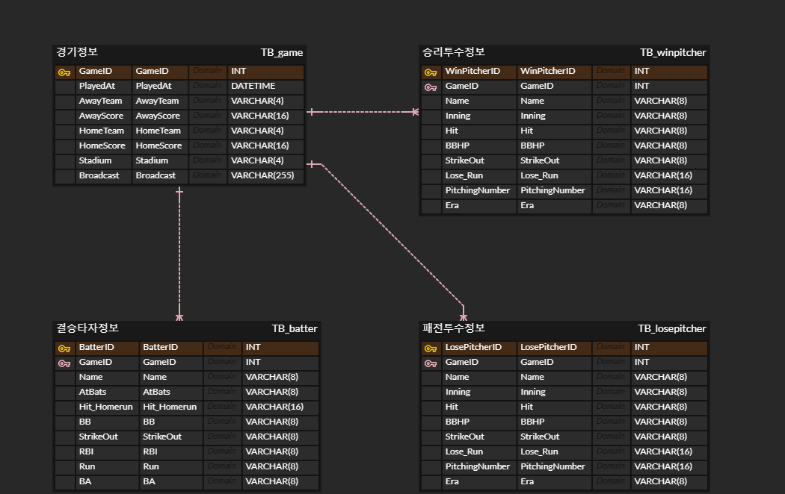
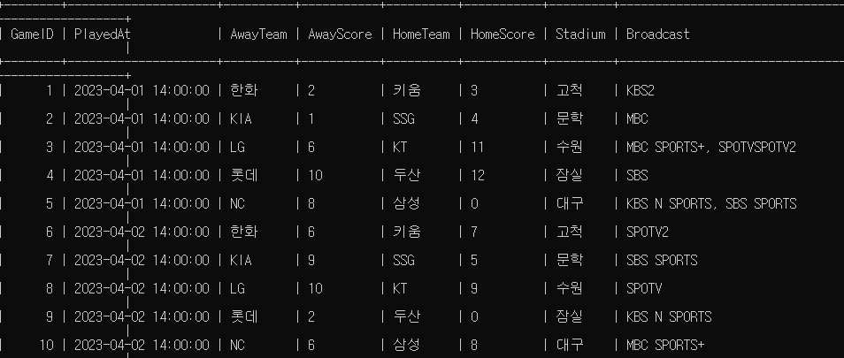
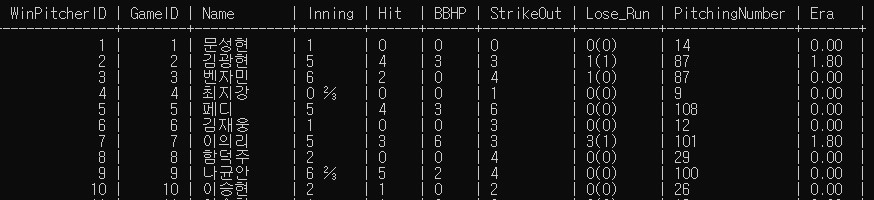
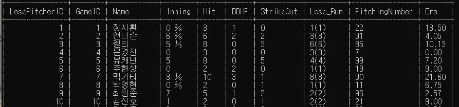
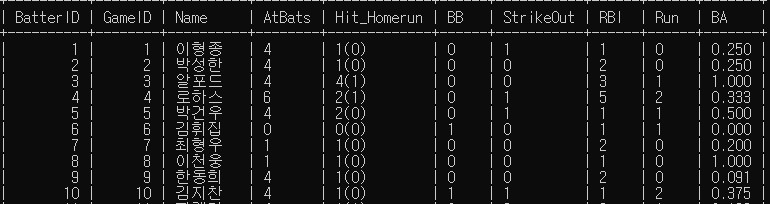

#  :baseball:2023시즌 KBO프로야구 경기결과 업데이트 프로젝트:baseball:

## 프로젝트 소개
스포츠 중계방송사별로 매일 프로야구 경기가 끝나자마자 모든 경기의 승리투수, 패전투수,   
결승타를 친 수훈선수에 대한 기록을 리뷰를 해주는 프로그램이 있는 것처럼   
모든 경기 결과와 경기에 대한 승리투수, 패전투수, 결승타자 기록을 DB에 업데이트하는 코드를 구현하고자 했다.  

## 사용 url
```
f"https://sports.news.naver.com/kbaseball/schedule/index?date={}&month={}&year={}&teamCode="

```
이외에도 fetch를 통해 json파일을 읽어와서 경기기록을 크롤링했다.

## 기술스택
 

## 구현 로직
### MySQL(MariaDB)
1. ERD cloud를 통해 데이터베이스위의 경기결과, 승리투수, 패전투수, 결승타자 정보를 기록하는  
테이블에 들어갈 칼럼들을 구성하고 테이블의 관계를 설정한다.  
2. MariaDB에 BASEBALL데이터베이스를 만들고 사용한다.  
3. 2번의 데이터베이스 위에 ERD cloud에서 구성한 테이블을 만든다.   
### 파이썬
1. 데이터베이스에 있는 경기결과 테이블에 이틀 전 경기기록이 있으면 패스하고,  
없으면 이틀전까지의 경기결과와 승리투수, 패전투수, 결승타자의 기록을   
크롤링하여 각 정보에 해당하는 데이터 베이스 테이블에 넣는다.  
2. 1번과 같은 원리로 어제 경기기록을 확인하고 기록이 있으면 패스하고,  
없으면 어제 경기결과와 승리투수, 패전투수, 결승타자의 기록을   
크롤링하여 각 정보에 해당하는 데이터 베이스 테이블에 넣는다.  
3. while문을 이용해 매 정시마다 1번과 2번을 실행하는 함수를 만들어 실행한다.  

## 프로젝트 구조
📦sub_proj ->프로젝트 폴더  
 ┣ 📂bb_modules ->main.py에 사용되는 모듈들을 모아놓은 폴더  
 ┃ ┣ 📜baseballdb_config ->MySQL(MariaDB)에 연결시키기 위해 init에 들어갈 개인정보  
 ┃ ┣ 📜baseball_db.py -> MySQL(MariaDB)을 작동시킬 여러 함수들을 클래스화 한 모듈  
 ┃ ┣ 📜first_baseball_crawler.py -> 최초로 크롤링하는 함수들을 클래스화 한 모듈  
 ┃ ┗ 📜update_baseball_crawler.py -> 하루 전날의 경기결과와 기록들을 크롤링하는 함수들을 클래스화 한 모듈  
 ┣ 📜BASEBALL_DB_COMMAND.sql -> 데이터베이스에서 사용하는 sql명령어 정리  
 ┣ 📜main.py -> 실제 작동시킬 코드  
 ┗ 📜README.md -> 프로젝트를 설명하는 지금 이 파일  

## ERD cloud


## 데이터베이스에 업데이트 된 테이블
- 경기결과  
   
- 승리투수정보  
  
- 패전투수정보  
  
- 결승타자정보  
   
